# Virtual server in the cloud with access to Earth Observation (EO) data 

In addition to the standard [CDSE services](CDSE.md) the hackathon participants can launch virtual server in the [CREODIAS](https://creodias.eu/) platform provided by CloudFerro. 

For the access to the CREODIAS platform each team will receive one Keystone credential and an SSH key to be used with the pre-configured OS-GEO live server with additional services (Rstudio, JupyterHub, Shiny, Apache Superset).

During the hackathon in the [Horizon Dashboard](https://horizon.cloudferro.com/) the participants have to use the option ***Keystone credentials*** and use the Domain ***cloud_078898*** and region ***WAW3-2***.  

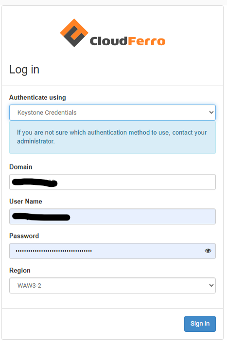

After the first login, the participants should be able to see the pre-launched server with GPU support. The participants from the Dashboard can terminate the preconfigured server and can launch additional service till the allowed overall limit per team, which are:

 - **max 20 instances**
 - **max 20 CPU cores** total in all instances
 - **max 50 GB RAM** total in all instances
 - **max 10 disks** with a **max 1000 GB** storage in total

From the virtual servers you can access the CDSE resources and the additional datasets which are mentioned in the [Data Catalogue](data-catalogue.md).

:::{Note}
The sample notebooks to access the datasets together with some description of the data are available in these folders in this repository:
 - [cdse-notebooks](https://github.com/eurostat/eubd2025_docs/tree/main/cdse-notebooks)
 - [cf-notebooks](https://github.com/eurostat/eubd2025_docs/tree/main/cf-notebooks)
 - [docs](https://github.com/eurostat/eubd2025_docs/tree/main/docs)
:::
 
## Step by step instructions to recreate the customized image with additional services (JupyterHub,Rstudio,Shiny,Superset)

1. After login in to the [Horizon dashboard](https://horizon.cloudferro.com/) go to the ***Instances*** in the left menu and choose ***Launch Instance***.

  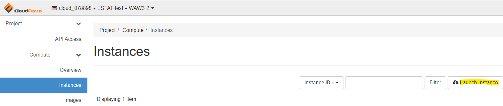

2. In the new window first you give a name to your instance

  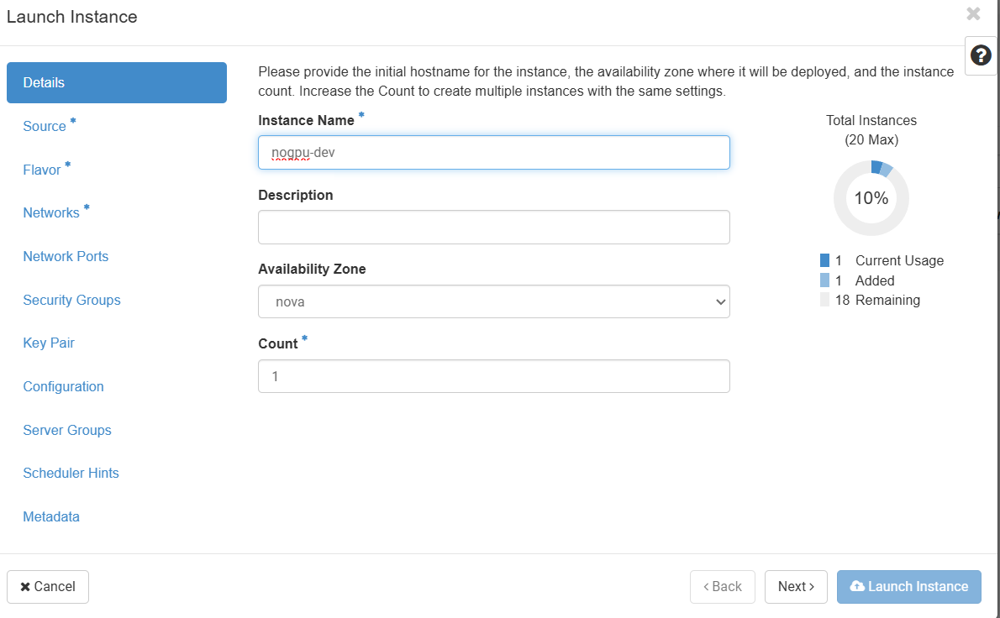

3. Then select the source of the image: ***OSGeoLive 16.0***

  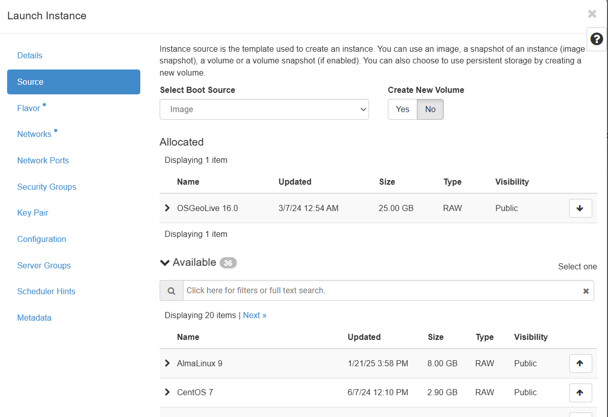

4. The next step is to select the flavor of the instance e.g. size of CPU, RAM and disk. 

  :::{Important}
  The instance should have at least **40GB** of disk!
  :::

  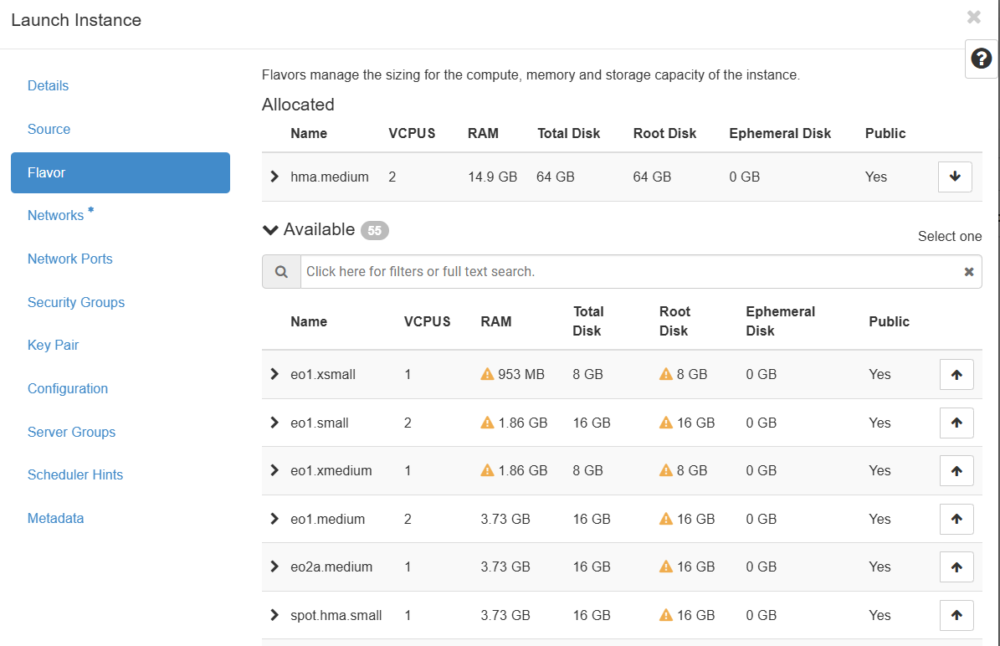

5. Under the networks add both networks 

  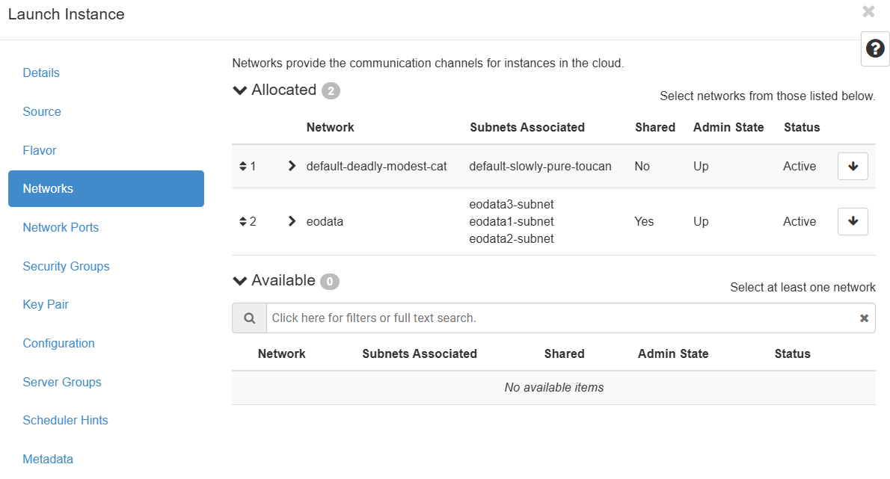

6. Under the Security Groups enable the following ports for incoming connections:

 - 22 (SSH)
 - 3389 (RDP)
 - 3838 (Shiny)
 - 8000 (JupyterHub)
 - 8088 (Superset)
 - 8787 (Rstudio)

:::{Note}
In the account there can be already predefined security groups contain these port. If not, you have to create it following [these instructions](https://creodias.docs.cloudferro.com/en/latest/cloud/How-to-use-Security-Groups-in-Horizon-on-Creodias.html)
:::

  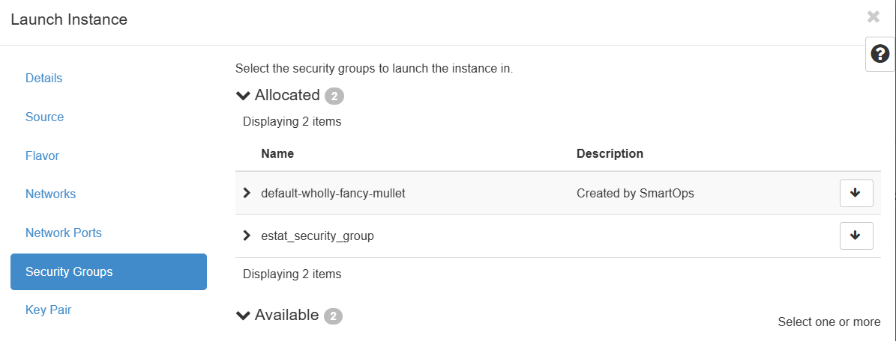

7. Finally you select or create an SSH key pair that will be used to connect to the instance for the first time.

  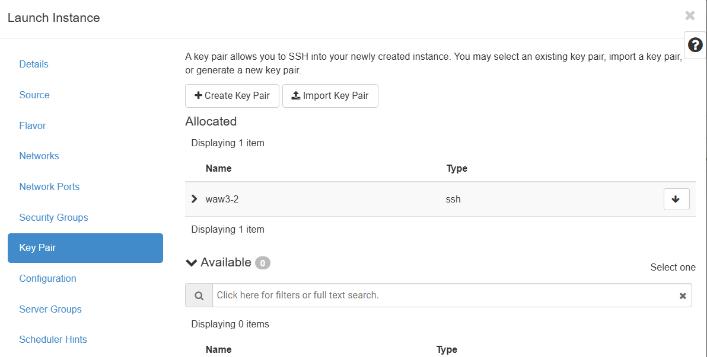

8. Launch the instance and wait until it will be running

9. Create and associate an external IP following [these steps](https://creodias.docs.cloudferro.com/en/latest/networking/How-to-Add-or-Remove-Floating-IPs-to-your-VM-on-Creodias.html)

  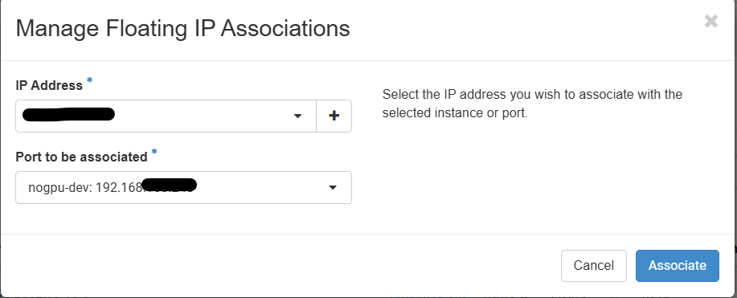

10. Then you can access your instance with an SSH client, and the first step will be to create a password for the default `eouser`. After creating the password the connection will be automatically closed.

  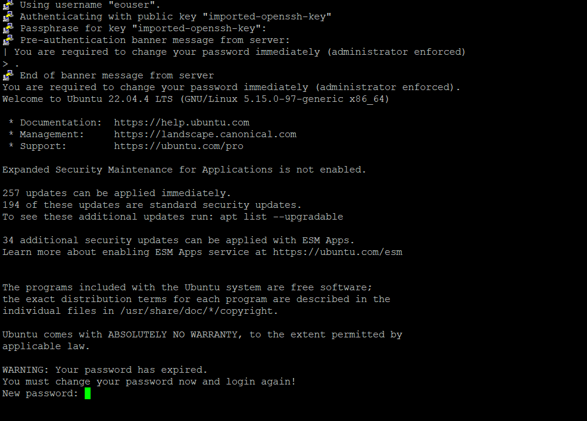

11. To enable RDP and add the additional services you have to run the following shell script: [add_services_nogpu.sh](scripts/add_services_nogpu.sh)
    For that, you have to upload/copy (e.g. WinSCP) to the server. Make it executable and run in a terminal.
    
    ```{code-block} 
    chmod +x add_services_nogpu.sh
    ./add_services_nogpu.sh
    ```
    
    :::{Important}
    Before you run the script replace in the script on row 136 the Superset admin password `<your_superset_password>` with your own password. 
    :::
    
    :::{Note}
    The script runs and install all the services and libraries. The script restarts several times the server during the installation process and can last up to 1 hour.
    You can check the installation status with `more ~/.service_install_status` in the terminal. When it finishes the status will be `everything went well`.  
    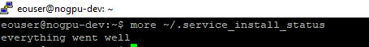
    :::
    
## Accessing the services

**RDP**

The service is available under the external IP:3389 created under point 9 above in standard RDP clients.  In case you are behind proxy you can tunnel the internal IP:3389 through SSH to your localhost and connect to your localhost port with the RDP client.  

**Shiny**

The service is available in a browser under the external  IP:3838 created under point 9 above. 

**JupyterHub**

The service is available in a browser under the external IP:8000 created under point 9 above. The username is `eouser` and password what is defined under point 10.   

**Apache Superset**

The service is available in a browser under the external IP:8088 created under point 9 above. The username is `eouser` and password what is defined under point 11 defined in the `add_services_nogpu.sh`.   

**Rstudio**

The service is available in a browser under the external IP:8787 created under point 9 above. The username is `eouser` and password what is defined under point 10.   


