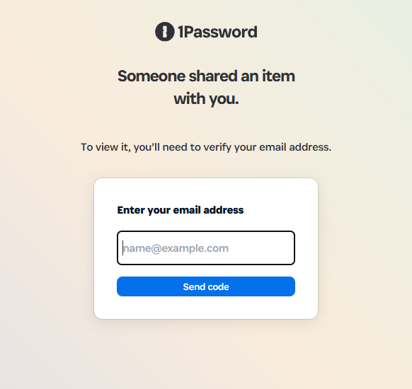
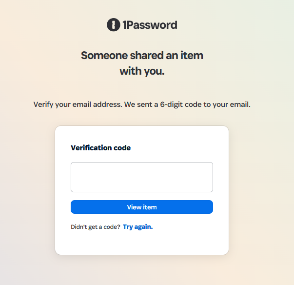
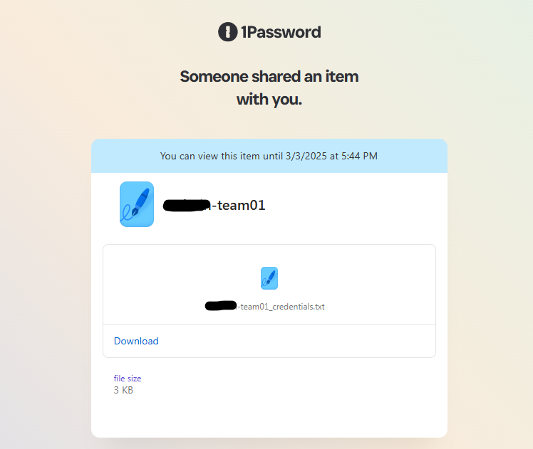
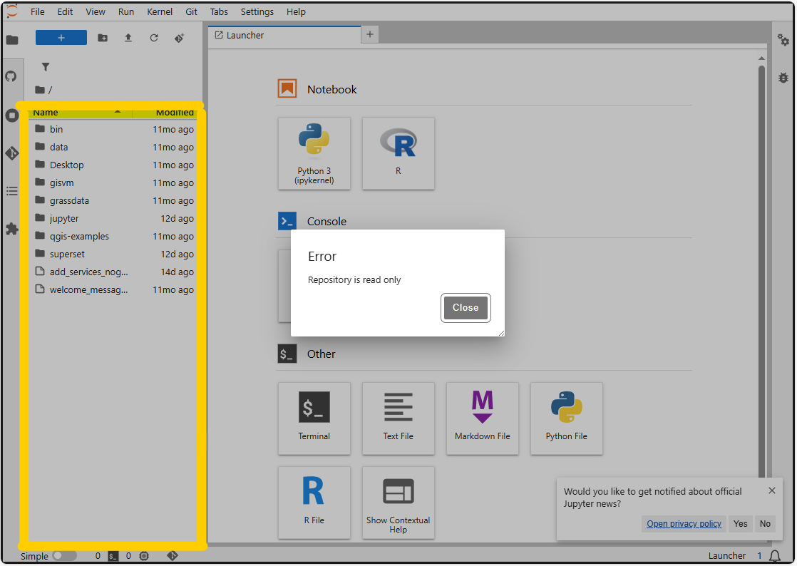

# Virtual server in the cloud with access to Earth Observation (EO) data 

In addition to the standard [CDSE services](CDSE.md) the hackathon participants can launch virtual server in the [CREODIAS](https://creodias.eu/) platform provided by CloudFerro. 

From the virtual servers you can access the CDSE resources and the additional datasets which are mentioned in the [Data Catalogue](data-catalogue.md).

:::{Note}
The sample notebooks to access the datasets together with some description of the data are available in these folders in this repository:
 - [cdse-notebooks](https://github.com/eurostat/eubd2025_docs/tree/main/cdse-notebooks)
 - [cf-notebooks](https://github.com/eurostat/eubd2025_docs/tree/main/cf-notebooks)
 - [docs](https://github.com/eurostat/eubd2025_docs/tree/main/docs)

In order to recreate the extended OSGeoLive image, follow [these instructions](osgeoplus.md).
:::

## First steps at the hackathon

1. The hackathon participants receive a message with a link in your team private channel. Clicking on the link you get to 1password site.

2. Each participant should provide the email what (s)he used for the CDSE registration and on that email a verification code will be sent that has to be entered in the next screen.

3. After successful verification the participant will be able to download a text file containing all the credentials.

4. The access of the cloud environment is possible through the [Horizon Dashboard](https://horizon.cloudferro.com/auth/login/?next=/) by using the domain, username, password and region provided in the text file download in step 3.  (Authenticate using: ***Keystone credentials***, region ***WAW3-2***).  

5. After the first login, the participants should be able to see the pre-launched server with GPU support. The running server is a pre-configured [OSGeoLive](https://live.osgeo.org/en/index.html) server with additional services (Rstudio, JupyterHub, Shiny, Apache Superset). 
The external/public IP address of the server is available in the [Horizon Dashboard](https://horizon.cloudferro.com/) under the ***Instances*** tab in the left menu. 
The participants from the Dashboard can terminate the preconfigured server and can launch additional service till the allowed overall limit per team, which are:

 - **max 20 instances**
 - **max 20 CPU cores** total in all instances
 - **max 50 GB RAM** total in all instances
 - **max 10 disks** with a **max 1000 GB** storage in total

6. Using the SSH key from the file downloaded in step 3 the participant should login with ssh to running server and change password. 

    :::{Important}
    The default username is ***eouser***. 
    :::

After login usually the first step is to create a password for the default user (***eouser***). After creating the password the connection will be automatically closed.

  

If the user not prompted directly to change password, it can be done manually by the following command:

: sudo passwd eouser

7. **After the setup of the password the server is ready to use!**

 
## Accessing the services

### RDP

The service is available in standard RDP clients at the `<external/public IP>:3389` retrieved under step 5 above.  In case the participant is behind a proxy, the connection can be tunneled from the `<internal IP:3389>` through SSH to the `<localhost>:xxxx` and connect to the localhost port with the RDP client.  

### Shiny

The service is available in a browser under the `<external/public IP:3838>` retrieved under step 5 above. 

### JupyterHub

The service is available in a browser under the `<external/public IP:8000>` retrieved under step 5 above. The username is `eouser` and password what is defined under step 6 above.   

:::{Note}
In case after the first lunch the user receive the error that the repository is read only, the user should first click on the highlighted left file browser panel first and then the read-only protection disappears. 
  
:::

### Apache Superset

The service is available in a browser under the `<external/public IP:8088>` retrieved under step 5 above. The username is `eouser` and password is `eubdHack25`.   

### Rstudio

The service is available in a browser under the `<external/public IP:8787>` retrieved under step 5 above. The username is `eouser` and password what is defined under step 6 above.   

