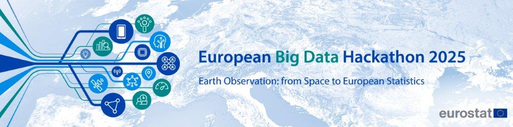

# 2025 EU Big Data hackathon documentation 

The theme of the 2025 EU Big Data hackathon is the use of Earth Observation (EO) data for statistics.

**[The data catalogue](data-catalogue.md)** provides an overview of datasets that can be used during the hackathon.

The participants will be provided with a cloud environment to use the datasets mentioned above. The cloud platform has 2 main components:

 - [Copernicus Data Space Ecosystem (CDSE)](CDSE.md)   
 - [Cloud servers](CF.md) in the [CREODIAS platform](https://creodias.eu/) provided by [CloudFerro](https://cloudferro.com/)   