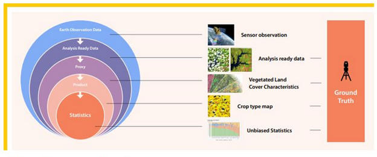
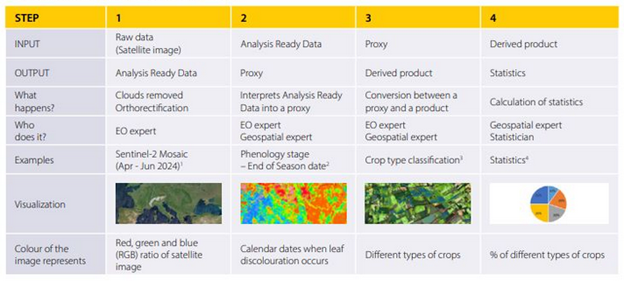

# Data Catalogue

## Introduction

For the 2025 hackathon, to solve the data challenge announced on the evening of 6 March 2025, you should use open Earth Observation data available in the Copernicus Space Data Ecosystem (**‘hackathon primary datasets’**). You can complement them with:

- European Statistics datasets made available on the hackathon data platform for all hackathon teams (**‘hackathon auxiliary datasets’**),
- Your own dataset, which should be representative of data available in other EU countries and fit within the size limits defined for the hackathon datasets (**‘own hackathon datasets’**).

The purpose of this data catalogue is to support hackathon participants in their preparation for the event. 

The data catalogue has been prepared by Eurostat, in collaboration with and based on the material developed by DG DEFIS and the European Space Agency. *Please note that this is the final version of the data catalogue.*

## Structure of this Data Catalogue

1. Quick recap on the use of Earth Observation Data for official statistics
2. Earth Observation Data available at the Copernicus Data Space Ecosystem (CDSE)
3. Auxiliary Hackathon Data
4. Teams’ Own Hackathon Datasets 
5. How to set up an individual CDSE account?
6. Link to the hackathon platform documentation with sample codes for data access and processing

## 1: Quick Recap on the Use of Earth Observation Data for Official Statistics

Earth Observation Data show substantial potential for producing new, more timely and granular statistical outputs and reducing response burden. However, to be able to use this data to produce statistics, new methods and tools have to be deployed that require new skills and competencies from statisticians and close collaboration with data scientists, geospatial agency experts and researchers.

To be used for official statistics purposes, Earth Observation data require preprocessing along the value-added chain as presented in the diagramme and table below. All hackathon teams need to closely reflect on what Earth Observation Data inputs available at the CDSE they will be working on and what statistics production stage(s) their application needs to address, taking into consideration the data challenge, event’s time constraints and resources capacity limits.

## 2: Earth Observation Data Available at the Copernicus Data Space Ecosystem (CDSE) – Hackathon primary datasets

The available [data collections on the CDSE and CREO-DIAS platforms](https://dataspace.copernicus.eu/explore-data/data-collections), are structured in the following categories:

- [Sentinel data](https://dataspace.copernicus.eu/explore-data/data-collections/sentinel-data)
- [Copernicus Contributing Missions](https://dataspace.copernicus.eu/explore-data/data-collections/copernicus-contributing-missions/ccm-collections-description) 
- [Complementary data](https://dataspace.copernicus.eu/complementary-data)

This document should give an impression on the availability of data - for full information, please refer to the CDSE and CREO-DIAS documentation.

### Sentinel Data:
For operational needs of the Copernicus programme, several Sentinel satellites have been developed and launched. They specialize in different Earth Observation services and produce diverse sets of data [^1] with the following focus:

[^1]: For more information on the Copernicus programme, see: [https://sentiwiki.copernicus.eu/web/copernicus-programme](https://sentiwiki.copernicus.eu/web/copernicus-programme) 

| **Sentinel Mission** | **Focus** | **Products and Interesting Applications** | **More Information** |
|---|---|---|---|
| [Sentinel-1](https://dataspace.copernicus.eu/explore-data/data-collections/sentinel-data/sentinel-1) | High-resolution images of all landmasses, coastal zones, and shipping routes worldwide; vignettes of the global ocean | Radar data; monthly mosaics (identification of built-up area, water presence); a consistent long-term data archive for applications based on long time series |  [S1 Mission](https://sentiwiki.copernicus.eu/web/s1-mission)   Interactively explore [Sentinel-1](https://link.dataspace.copernicus.eu/e4gb), [Sentinel-1 monthly mosaics](https://link.dataspace.copernicus.eu/wqq5) |
| [Sentinel-2](https://dataspace.copernicus.eu/explore-data/data-collections/sentinel-data/sentinel-2) | Land services, including the monitoring of vegetation, soil and water cover, as well as the observation of inland waterways and coastal areas | Optical data from 2015 – onwards; quarterly mosaics (identification of vegetation, green areas, arable land, agriculture activities, forests, water and wetness, green roofs); land monitoring, agriculture, emergency management, risk mapping, security, forestry, climate change, disaster control, marine and humanitarian relief operations | [S2 Mission](https://sentiwiki.copernicus.eu/web/s2-mission)   Interactively explore [Sentinel-2](https://link.dataspace.copernicus.eu/ddj4), [vegetation indices](https://link.dataspace.copernicus.eu/iodm), [Sentinel-2 quarterly mosaics](https://link.dataspace.copernicus.eu/ontg) |
| [Sentinel-3](https://dataspace.copernicus.eu/explore-data/data-collections/sentinel-data/sentinel-3) | Sea surface topography, sea and land surface temperature, and ocean and land surface color with high accuracy and reliability  | Support to ocean forecasting systems, environmental monitoring, and climate monitoring | [S3 Mission](https://sentiwiki.copernicus.eu/web/s3-mission)   Interactively explore Sentinel-3 [OLCI](https://link.dataspace.copernicus.eu/rgq0), [OLCI Land](https://link.dataspace.copernicus.eu/be8v) and [SLSTR](https://link.dataspace.copernicus.eu/yrt7) |
| [Sentinel-5P](https://dataspace.copernicus.eu/explore-data/data-collections/sentinel-data/sentinel-5p) | Daily global observations of key atmospheric constituents | Monitoring and forecasting air quality, the ozone layer, and climate change | [S5P Mission](https://sentiwiki.copernicus.eu/web/s5p-mission)   Interactively explore [Sentinel-5p weekly NO2 mosaic](https://link.dataspace.copernicus.eu/72fl) |

:::{Note}
You will find several Jupyter Notebook examples on how to extract information from these data collections here:
[https://documentation.dataspace.copernicus.eu/Usecase.html](https://documentation.dataspace.copernicus.eu/Usecase.html) 
:::

### Copernicus Contributing Missions (CCM):

Copernicus Sentinel missions and provide the following types of datasets:
 -	Optical High Resolution (HR) and Very High Resolution (VHR) images
 -	Synthetic-Aperture Radar (SAR) imagery
with different regional, European and worldwide coverages.
Of interest could be in this context in particular Very High-Resolution mosaics and composites e.g. [VHR-IMAGE-2021](https://dataspace.copernicus.eu/explore-data/data-collections/copernicus-contributing-missions/collections-description/VHR-IMAGE-2021) (as well as  VHR imagery for past reference years: 2012, 2015, 2018) and, [Digital Elevation Models, e.g. Copernicus DEM](https://dataspace.copernicus.eu/explore-data/data-collections/copernicus-contributing-missions/collections-description/COP-DEM) and Vegetation phenology and productivity products.

### Complementary Data:
They cover high-resolution satellite imagery from various providers and data offerings from different Copernicus services, including:
 -	[Copernicus Land Monitoring Service products (CLMS)](https://documentation.dataspace.copernicus.eu/Data/ComplementaryData/CLMS.html)
 -	[Landsat-5,7,8 (optical & thermal data for 1984 - now)](https://documentation.dataspace.copernicus.eu/Data/ComplementaryData/Landsat5.html)
 -	[Copernicus Marine Environment Monitoring Service (CMEMS)](https://documentation.dataspace.copernicus.eu/Data/ComplementaryData/CMEMS.html)
 -	[Soil Moisture and Ocean Salinity (SMOS)](Soil Moisture and Ocean Salinity (SMOS))  
For more information, see: [Complementary data | Copernicus Data Space Ecosystem](https://dataspace.copernicus.eu/complementary-data) 

:::{Note}
For a more complete picture, and detailed information on every available product, please refer to the [Data Documentation](https://documentation.dataspace.copernicus.eu/Data.html).
:::

## 3: Relevant official statistics data and services - Hackathon auxiliary datasets

The auxiliary statistical datasets will be made available for all participants via API and object storage. They will cover:  

 - **NUTS regions (geopackage)**
Nomenclature of Territorial Units for Statistics (NUTS) are a multi-level system of polygons that represent the territory classed for statistical purposes.  The NUTS data are provided for the year 2021 and 2024 version at map scale of 1:1million 
For more information:
[https://ec.europa.eu/eurostat/web/gisco/geodata/statistical-units/territorial-units-statistics](https://ec.europa.eu/eurostat/web/gisco/geodata/statistical-units/territorial-units-statistics)
[https://ec.europa.eu/eurostat/web/nuts/overview](https://ec.europa.eu/eurostat/web/nuts/overview)

:::{Note}
Here is a sample code how to access and use the NUTS data in the platform: [NUTS data notebook](cf-notebooks/Example_NUTS.ipynb).
:::

 -	**Population grid (geopackage and raster, 1km resolution)**  
The population grid is a geographical dataset showcasing 13 different population-related variables (e.g. total population, its breakdown by sex) produced on the 1 km2 grid during the Census 2021 by the EU Member States. The projection is the ETRS89-LAEA grid. 
For more information: [https://ec.europa.eu/eurostat/web/gisco/geodata/population-distribution/geostat](https://ec.europa.eu/eurostat/web/gisco/geodata/population-distribution/geostat) 

:::{Note}
Here is a sample code how to access and use the population grid data in the platform: [Census data notebook](cf-notebooks/Example_Census_GRID.ipynb).
:::

 - **GISCO Reference Grid**
The reference grid provides the reference geometry for each 1km grid cell covering the land surface of the European continent plus an extended (e.g. buffered) area into the sea. The grid cell Ids are according to the INSPIRE specifications. Documentation and metadata are found in [https://gisco-services.ec.europa.eu/grid/GISCO_grid_metadata.pdf](https://gisco-services.ec.europa.eu/grid/GISCO_grid_metadata.pdf)
For more information on Eurostat’s GISCO services, see also: [https://ec.europa.eu/eurostat/web/gisco; https://ec.europa.eu/eurostat/web/gisco/geodata](https://ec.europa.eu/eurostat/web/gisco; https://ec.europa.eu/eurostat/web/gisco/geodata)

:::{Note}
Here is a sample code how to access and use the reference grid data in the platform: [Reference grid notebook](cf-notebooks/Example_GISCO_Reference_Grid.ipynb).
:::

 - **Global Human Settlement layer (raster)** 
The collection consists in three main type of products: built-up (GHS-BUILT), population (GHS-POP) grids, and city model (GHS-SMOD). The datasets are published as raster files together with pyramids (i.e., TIF and OVR files). 
For more information, see: [https://data.jrc.ec.europa.eu/collection/ghsl](https://data.jrc.ec.europa.eu/collection/ghsl);  project home page: [http://ghsl.jrc.ec.europa.eu/](http://ghsl.jrc.ec.europa.eu/); SciHub page: [https://ec.europa.eu/jrc/en/scientific-tool/global-human-settlement-layer?search](https://ec.europa.eu/jrc/en/scientific-tool/global-human-settlement-layer?search)

:::{Note}
Here is a sample code how to access and use the GHS data in the platform: [GHS notebook](cf-notebooks/Example_GHSL.ipynb).
:::

 -	**Land cover (CORINE or ESA WorldCover)**
Specific datasets be chosen from: [https://land.copernicus.eu/en/dataset-catalog](https://land.copernicus.eu/en/dataset-catalog) or [https://esa-worldcover.org/en/data-access](https://esa-worldcover.org/en/data-access) 
Interactively explore [Copernicus Global Land](https://link.dataspace.copernicus.eu/4h8s). 

:::{Note}
Here is a sample code how to access and use the Land cover data in the platform: [Land cover notebook](cdse-notebooks/openeo-example.ipynb).
:::

 - **Field polygons for all countries over Europe for 2022** 
Vector dataset is available and described here: [https://zenodo.org/records/14229033](https://zenodo.org/records/14229033)

:::{Note}
Here is a sample code how to access and use the Field polygons in the platform: [Field polygons notebook](cf-notebooks/Example_Field_boundaries.ipynb).
:::
 
 - **Natura 2000**
Natura 2000 is an ecological network of protected areas, set up to ensure the survival of Europe's most valuable species and habitats. Natura 2000 is based on the 1979 Birds Directive and the 1992 Habitats Directive. Natura 2000 is the key instrument to protect biodiversity in the European Union.    For the latest version (from 23.04.2024), see:  [https://sdi.eea.europa.eu/catalogue/biodiversity/eng/catalog.search#/metadata/805a487f-a7ef-42e9-ba08-9501289a56c6](https://sdi.eea.europa.eu/catalogue/biodiversity/eng/catalog.search#/metadata/805a487f-a7ef-42e9-ba08-9501289a56c6)  

:::{Note}
Here is a sample code how to access and use the Natura 2000 data in the platform: [Natura 2000 notebook](cf-notebooks/Example_Natura_2000.ipynb).
:::

 - **Climate Data Store**
The Climate Data Store provides authoritative information about the past, present and future climate in Europe and the rest of the World.  For more information see:  [https://cds.climate.copernicus.eu/#!/home](https://cds.climate.copernicus.eu/#!/home)  

:::{Note}
Here is a sample code how to access and use data from the climate data store in the platform:  [Climate data store notebook](cdse-notebooks/climate-data-access.ipynb).
:::
  

## 4: Own Hackathon Datasets

You can either:
-	upload the datasets to your individual CDSE account at the time of your convenience  , respecting all relevant rules with regard to the size or format, or 
-	upload the data for your hackathon teams project onto the hackathon customised data platform through the S3 cloud bucket during the event, also respecting the relevant file size and format requirements. For raster data, you can [ingest them to Sentinel Hub](https://documentation.dataspace.copernicus.eu/APIs/SentinelHub/Byoc.html) in order to use them programmatically, similarly as Sentinel, Global Land Cover, etc. 

:::{Important}
Own datasets used in your hacking work should have (close) equivalents in other EU countries so that the project could be replicable at the EU level
:::

## 5: How to set up a CDSE account?

Each participant has to set up his/her individual CDSE account and explore various datasets and standard functionalities: [https://identity.dataspace.copernicus.eu/auth/realms/CDSE/protocol/openid-connect/auth?client_id=cdse-public&response_type=code&scope=openid&redirect_uri=https%3A//dataspace.copernicus.eu/account/confirmed/1](https://identity.dataspace.copernicus.eu/auth/realms/CDSE/protocol/openid-connect/auth?client_id=cdse-public&response_type=code&scope=openid&redirect_uri=https%3A//dataspace.copernicus.eu/account/confirmed/1)

:::{Note}
During the registration if you mark that you want to access Copernicus Contributing Missions data, please choose ‘Not applicable’ in the field for ‘Copernicus Service Project Name’.
:::

For more information, see also: [https://dataspace.copernicus.eu/news/2024-12-9-how-and-why-use-copernicus-data-space-ecosystem-hackathons](https://dataspace.copernicus.eu/news/2024-12-9-how-and-why-use-copernicus-data-space-ecosystem-hackathons)

## 6: Link to the hackathon platform documentation with sample codes for data access and processing 

The computational resources available during the hackathon is described in this repository under the following link:

**[https://eurostat.github.io/eubd2025_docs/](https://eurostat.github.io/eubd2025_docs/)** 
